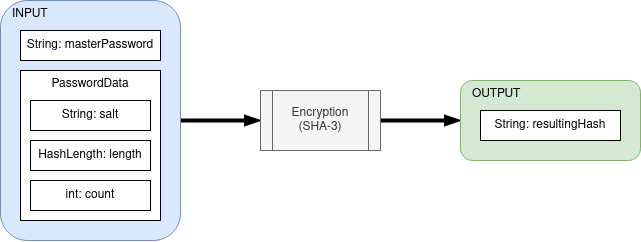

# Murmelpass

*NOTE: This app is in a testing phase and is not functioning yet. UI and functionality will come to change.*

---

*A password manager that doesn't store any passwords.*
 

## 1. Purpose

A safe way to access unique passwords, without actually storing them anywhere, and accessing them with *one master password* that together with the stored data of that unique password procedurally generates the correct password for you. No verification, no decryption, nothing to crack.

## 2. Method

*Figure 1: Method overview*

The input consists of your master password that is not stored but required when attempting to access (generate) your password. The password data (salt, length, count) is stored but cannot by itself produce the correct password. When attempting to generate your chosen password the salt is appended to the masterpassword and passed into the SHA-3 function generating a password with a length of the specified length in the passed password data and iterated on itself the number of times the specified count in that same password data is. This results in a hash that is meant to be your password.
